```{css, echo=FALSE}
# CSS for including pauses in printed PDF output (see bottom of lecture)
@media print {
  .has-continuation {
    display: block !important;
  }
}
.remark-code-line {
  font-size: 95%;
}
.small {
  font-size: 75%;
}
.scroll-output-full {
  height: 90%;
  overflow-y: scroll;
}
.scroll-output-75 {
  height: 75%;
  overflow-y: scroll;
}
```

```{r setup, include=FALSE}
options(htmltools.dir.version = FALSE)
library(knitr)
library(fontawesome)
knitr::opts_chunk$set(
	fig.align = "center",
	cache = FALSE,
	dpi = 300,
  warning = F,
  message = F,
	fig.height = 5,
	out.width = "80%"
)
```
# Table of Contents

1. [Prologue](#prologue)

1. [R Markdown](#markdown)

1. [Version Control](#control)

1. [GitHub Desktop](#desktop)

1. [Other Tips and Productivity Tools](#tips)

1. [Not Covered: Git(Hub) + RStudio](#gitr)

1. [Not Covered: Troubleshooting Git Credential Issues in RStudio](#gitcred)


---
class: inverse, middle
name: prologue

# Prologue

<!-- software installations, checking registrations-->

---
# Prologue

Before we dive in, let's double check that we all have

`r fa('square-check')` Installed [.hi-orange[R]](https://www.r-project.org/).

`r fa('square-check')` Installed [.hi-orange[RStudio]](https://docs.posit.co/ide/user/#open-source).
	
`r fa('square-check')`  Signed up for an account on [.hi-orange[Github]](https://github.com/)

`r fa('square-check')`  Applied for a [.hi-orange[Github Education]](https://github.com/education/students) license

`r fa('square-check')` Installed [.hi-orange[Git]](https://happygitwithr.com/install-git) and [.hi-orange[Github Desktop]](https://desktop.github.com/)

`r fa('square-check')`  Log into your Github account on Github Desktop

---
class: inverse, middle
name: markdown

# R Markdown

---
#R Markdown

Before we dive into version control, let's chat about .hi-medgrn[R Markdown].

--

R Markdown is a document type that allows for integration of R code and output into a Markdown document. 

.hi-blue[Resources:]
- Website: [.hi-orange[rmarkdown.rstudio.com]](https://rmarkdown.rstudio.com)
- [.hi-orange[R Markdown Cheatsheet]](https://github.com/rstudio/cheatsheets/raw/main/rmarkdown-2.0.pdf)
- Book: [.hi-orange[R Markdown: The Definitive Guide]](https://bookdown.org/yihui/rmarkdown) (Yihui Xie, JJ Allaire, and Garrett Grolemund)

---
#R Markdown

Before we dive into version control, let's chat about .hi-medgrn[R Markdown].


R Markdown is a document type that allows for integration of R code and output into a Markdown document. 

.hi-pink[Other points:]
- We'll be completing assignments using R Markdown.
- FWIW, my lecture slides and notes are all written in R Markdown too. (E.g. This slide deck is built using the [.hi-orange[xaringan]](https://github.com/yihui/xaringan/wiki) package with the metropolis theme.)


---
# R Markdown: Getting Started

`r fa('square-check')` Installed [.hi-orange[R]](https://www.r-project.org/).

`r fa('square-check')` Installed [.hi-orange[RStudio]](https://docs.posit.co/ide/user/#open-source).

--

`r fa('square')`  Add the `rmarkdown` package


```{r, eval = FALSE}
install.packages("rmarkdown")
```

--

`r fa('square')` Install LaTeX
  * If just for this, can use [.hi-orange[TinyTex]](https://yihui.name/tinytex/)

```{r, eval = FALSE}
# Install only if you don't have LaTeX already
install.packages("tinytex")
tinytex::install_tinytex()
```

---
# R Markdown: Creating a New .Rmd File

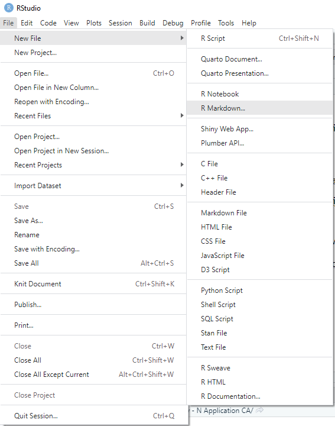 

---
# R Markdown: Creating a New .Rmd File

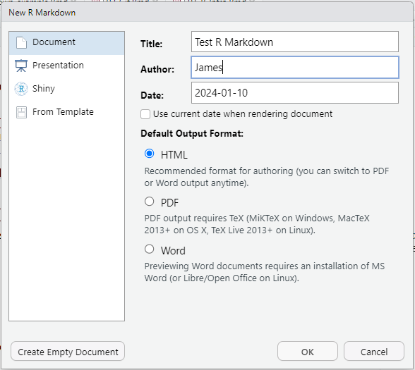 

---
# R Markdown: Creating a New .Rmd File

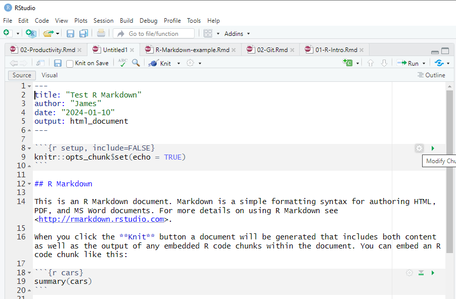 


---
# R Markdown Components

R Markdown combines
  1. .hi-purple[Markdown:] lightweight markup language
  1. .hi-pink[LaTeX:] typesetting for math
  1. .hi-medgrn[R:] include code and generate output
  
--

<br>
<br> 
Let's do some practice: .hi-slate[open a new .Rmd file] and try adding content as we go

---
# Markdown

.hi-purple[Markdown] allows for formatting text in a lightweight way

I highly recommend the handy [.hi-orange[Markdown Guide]](https://www.markdownguide.org/) for more details

---
# Markdown: Heading

.hi-blue[Headings] emphasize text and add chunks to your script

Largest heading with one leading \#  (slide title above) 

## Second Largest (\#\#)
### Third Largest (\#\#\#)
#### Getting Smaller... (\#\#\#\#)

**Bold Text** for comparison

Normal Text for comparison


---
# Markdown: Text Format

**Bold text** with \*\*your text\*\*

*Italicize* with \*single asterisks\*

Add `code text` with  grave accents (the back tick symbol, &#96;)
  * The other output of the tilde key `~` on keyboard

End a line with two spaces  to start a new paragraph 
  * or leave a line space between sentences

Can also start a new line with backslash (\\)


---
# Markdown: Text Format

Add superscripts<sup>2</sup> with ^carets^

Add ~~strikethroughs~~ with \~\~double tildes\~\~

Add a line break (horizontal rule) 

***

with \*\*\*

---
# Markdown: Text Format

Draw .hi-pink[tables] using | and -

  * | to delineate column breaks
  * \-\-\- to separate headers from entries
  
--

.pull-left[
\| Col A \| Col B \| Col C\|

\|&nbsp;\-\-\- &nbsp; &nbsp;    \| &nbsp;\-\-\- &nbsp;  \| &nbsp;\-\-\-   &nbsp; \|

\| This  &nbsp; \| is &nbsp; &nbsp;  \| a &nbsp; &nbsp;  &nbsp; \|

\| Table \| &nbsp; &nbsp; &nbsp; \| wow  &nbsp;  \|
]
--

.pull-right[
| Col A | Col B | Col C|
|---|---|---|
| This | is | a |
| Table | | wow|

]
---
# Markdown: Text Format

You can adjust the .hi-medgrn[alignment] of table text by adding `:`'s in the second row:
  - `:----` for left-aligned
  - `:---:` for center-aligned
  - `----:` for left-aligned

| Column A | Column B | Column C|
|:---|:---:|---:|
| Col A | is | left-aligned |
| Col B | is | center-aligned |
| Col C | is | right-aligned |


---
# Markdown: Lists

Add an .hi-purple[ordered list] with .hi-purple[1.]

  1. First Item
  1. Second Item
  1. No need to change the number - keep using 1. It will automatically update.
  
--

Add an .hi-medgrn[unordered list] with .hi-medgrn[\* or \-]

  * A thing
  * Another related thing
    - Indent to nest
      1. Can mix ordered and unordered

---
# Markdown: Inputs

Add a [link](https://www.markdownguide.org/cheat-sheet/) with \[\]()
  * \[text label\](URL)
  * Add direct link with &#60;URL&#62;   <https://www.markdownguide.org>
  
--

Add an image with !\[\]()
  * !\[alt text](link)
    * Where *link* is either a local file path or a URL


.hi-medgrn[practice] by adding `images/smile.png`:
  
  


---
# Markdown: LaTeX

Another advantage of Markdown is that it integrates  functionality for typesetting math.


--

Add an .hi-purple[inline equation] with &#36;TeX&#36;

$Var(X) = \sum\limits_{i=1}^n \frac{(x_i - \bar{x})^2}{n} ~~~~ ~~~ Y_{it} = \beta_0 + \beta_1 X_{it} + \epsilon_{it}$

--

Add multiple rows of LaTeX with 

&#36;&#36; 

LaTeX lines here

&#36;&#36;

Use the [.hi-orange[standard LaTeX commands]](https://kapeli.com/cheat_sheets/LaTeX_Math_Symbols.docset/Contents/Resources/Documents/index) for symbols/characters


---
# Rmd: R Code

R code is primarily executed with .hi-blue[code chunks]

--

Add a chunk with 
  * `Cmd + Option + I (Ctrl + Alt + I on PC)`
  * The `Insert` button in the UI
  * Manually type 

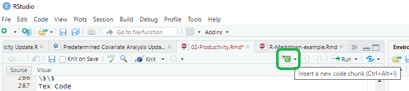
---
# Rmd: Code Chunks


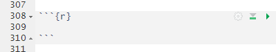 


.hi-blue[Code chunks] allow us to add as many lines of code as we want
  * Output will appear underneath after executing the full chunk
  * Can customize whether it runs, how output is displayed
  * Can run manually 
    * Line by line with `Cmd/Ctrl + Enter`
    * Entire chunk with `Run Entire Chunk` button

---
# Code Chunk Options

You can .hi-blue[add chunk options] in brackets after `r` and separated by commas.

Some commonly-used options include:

.hi-slate[Chunk label] (i.e. `sum`)
  * Must be unique names!
  * Doesn't appear in compiled document


.pull-left[
.hi-slate.center[RMarkdown File]

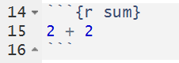 

]
.pull-right[
.hi-slate.center[Compiled File]

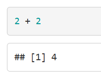 

]


---
# Code Chunk Options

`echo = FALSE` will 
  * .hi-medgrn[run the code] and 
  * .hi-purple[display output] but 
  * .hi-red[hide the code chunk] from the final document
    
.pull-left[
.hi-slate.center[RMarkdown File]

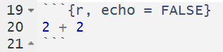 

]
.pull-right[
.hi-slate.center[Compiled File]

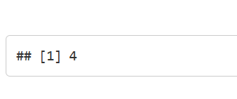 

]


---
# Code Chunk Options

`include = FALSE` will 
  * .hi-medgrn[run the code] but 
  * .hi-purple[hide the output] and 
  * .hi-red[hide the code chunk] from the final document
    
.pull-left[
.hi-slate.center[RMarkdown File]

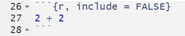 

]
.pull-right[
.hi-slate.center[Compiled File]

 

]

---
# Code Chunk Options

You can .hi-blue[add chunk options] in brackets after `r` and separated by commas.

Some commonly-used options include:

`eval = FALSE` will 
  * .hi-red[display code] in the chunk but 
  * .hi-medgrn[not run it] 
  * i.e. .hi-purple[no output] to display

.pull-left[
.hi-slate.center[RMarkdown File]

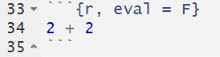 

]
.pull-right[
.hi-slate.center[Compiled File]

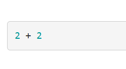 

]

---
# Code Chunk Options

You can also .hi-blue[change the color] of code chunks and/or output in the rendered document through code chunk options<sup>1</sup>
  * `class.source` to change the .hi-medgrn[code chunk]
  * `output.source` to change the .hi-red[output]

<br>

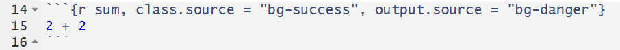 

---
# Code Chunk Options

You can also .hi-blue[change the color] of code chunks and/or output in the rendered document through code chunk options<sup>1</sup>
  * `class.source` to change the .hi-medgrn[code chunk]
  * `output.source` to change the .hi-red[output]


.pull-left[
.hi-slate[default] 

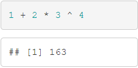 
]

.pull-right[
.hi-slate[`bg-primary`] 

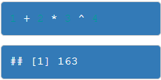 
]

.footnote[<sup>1</sup> We'll chat more about this when we get to web scraping, but what's actually happening here is that we're harnessing some built-in CSS classes to change the backgrounds. This also means that, using CSS, you can define custom classes and format things however you'd like.]


---
# Code Chunk Options

You can also .hi-blue[change the color] of code chunks and/or output in the rendered document through code chunk options<sup>1</sup>
  * `class.source` to change the .hi-medgrn[code chunk]
  * `output.source` to change the .hi-red[output]


.pull-left[
.hi-slate[`bg-success`] 

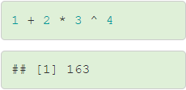 
]


.pull-right[
.hi-slate[`bg-info`] 

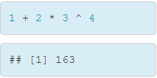 
]

.footnote[<sup>1</sup> We'll chat more about this when we get to web scraping, but what's actually happening here is that we're harnessing some built-in CSS classes to change the backgrounds. This also means that, using CSS, you can define custom classes and format things however you'd like.]

 
---
# Code Chunk Options

You can also .hi-blue[change the color] of code chunks and/or output in the rendered document through code chunk options<sup>1</sup>
  * `class.source` to change the .hi-medgrn[code chunk]
  * `output.source` to change the .hi-red[output]
  
.pull-left[
.hi-slate[`bg-warning`]

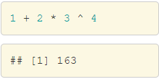 

]


.pull-right[
.hi-slate[`bg-danger`]

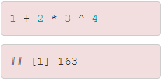 

]

.footnote[<sup>1</sup> We'll chat more about this when we get to web scraping, but what's actually happening here is that we're harnessing some built-in CSS classes to change the backgrounds. This also means that, using CSS, you can define custom classes and format things however you'd like.]


---
# Rmd: Inline Code

You can call R objects from earlier chunks .hi-medgrn[inline] with 

 r  


```{r}
four = 2+2
```

This can output in line with text: 2 + 2 = `r four`


---
class: inverse, middle


# R Markdown File Organization


---
# 1. Header
.pull-left[
RStudio automatically builds the R Markdown file from a template, which begins with a .hi-medgrn[header]
  * Title
  * Author
  * Date
  * Output Format
    * Main options<sup>2</sup>: HTML (`html_document`), PDF (`pdf_document`), LaTeX (`latex_document`), or Word (`word_document`)
]
.pull-right[

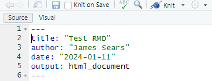 

]

.footnote[<sup>2</sup> See [.hi-orange[CH 3 of "R Markdown: The Definitive Guide" for more on how to customize output formats]](https://bookdown.org/yihui/rmarkdown/documents.html)]

---
# 2. R Setup

By default, RStudio adds a .hi-blue[setup] code chunk next.

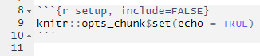 

  * Can set global options
  * Useful as your preamble
  * For [.hi-orange[R Notebooks]](https://bookdown.org/yihui/rmarkdown/notebook.html), this will automatically be run and is the only place where you can change your working directory 


---
# 3. Contents

From here on you can build the report/notebook as needed for the task.
  * Add any writing and outside graphics or [.hi-orange[bibTeX citations]](https://bookdown.org/yihui/rmarkdown-cookbook/bibliography.html)
  * Add code chunks to carry out desired analysis
  * Employ sections and formatting to structure the document as desired
  
---
# Compiling/Knitting

When you are ready to compile your final document, use the `Knit` button or `Ctrl/Cmd + Shift + K`

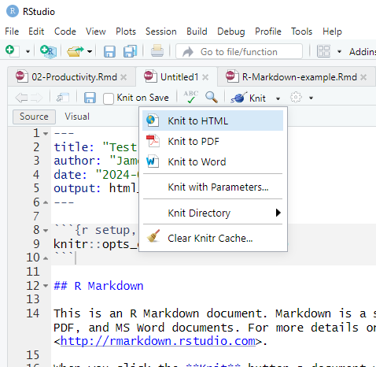 

---
# R Markdown: Knit to Compile Output (HTML, PDF)

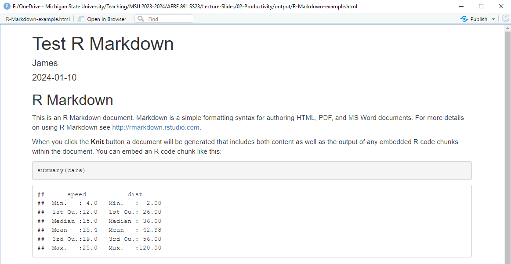 


---
class: inverse, middle

# Markdown Practice!

---
# Markdown Practice

  1. Create a new R Markdown file named "R-Markdown-Ex.RMD"
  1. In the setup chunk, load the `dslabs` and `tidyverse` packages
    * Use the `data()` function to read in the `divorce_margarine` dataset
  1. Add a header labeled "Correlation vs. Causation" and a text explanation below for why we often want to differentiate between the two
  1. Add a code chunk with the label `plot`
    * Type the following code:
    ```
    ggplot(divorce_margarine) +
    geom_point(aes(x = margarine_consumption_per_capita, 
                   y = divorce_rate_maine)) +
    labs(title = "Relationship between Margarine Consumption and 
                  Divorce Rates in Maine",
         subtitle = "2000-2009",
         x = "Margarine Consumption per Capita",
        y = "Divorce Rate")
     ```     
  1. Knit and save a PDF/HTML copy of the file to the "output" folder
  
  

---
# Table of Contents

1. [Prologue](#prologue)

1. [R Markdown](#markdown)

1. [Version Control](#control)

1. [GitHub Desktop](#desktop)

1. [Other Tips and Productivity Tools](#tips)

1. [Not Covered: Git(Hub) + RStudio](#gitr)

1. [Not Covered: Troubleshooting Git Credential Issues in RStudio](#gitcred)


```{r gen_pdf, include = FALSE, cache = FALSE, eval = FALSE}
infile = list.files(pattern = 'Productivity.html')
pagedown::chrome_print(input = infile, timeout = 21600)
```