```{css, echo=FALSE}
# CSS for including pauses in printed PDF output (see bottom of lecture)
@media print {
  .has-continuation {
    display: block !important;
  }
}
.remark-code-line {
  font-size: 95%;
}
.small {
  font-size: 75%;
}
.scroll-output-full {
  height: 90%;
  overflow-y: scroll;
}
.scroll-output-75 {
  height: 75%;
  overflow-y: scroll;
}
```

```{r setup, include=FALSE}
options(htmltools.dir.version = FALSE)
library(knitr)
library(fontawesome)
knitr::opts_chunk$set(
	fig.align = "center",
	cache = FALSE,
	dpi = 300,
  warning = F,
  message = F,
	fig.height = 5,
	out.width = "80%"
)
```

# Table of Contents

1. [Prologue](#prologue)

2. [Intro to Web Scraping](#web)

3. [Scraping Static Websites](#static)

4. [Interacting with Static Websites](#interact)


---
class: inverse, middle
name: prologue

# Prologue

---
# Prologue

Let's load in the packages that we'll need for today.


```{r}
pacman::p_load(httr2, lubridate, rvest, stringr, tidyverse)
```

---
# Data Acquisition

In order to wrangle, clean, or visualize data, we first need... data.

--

.center[
```{r, echo=F, out.width="100%"}

```
]
---

# Where Do Data Come from?

There is a whole spectrum, from DIY to plug-and-chug.

--

.hi-purple[1\. Pre-cleaned datasets posted on secondary repositories]
  - General and journal replication repositories
    - e.g. [Harvard Dataverse](https://dataverse.harvard.edu/)
  - Community-based repositories
    - e.g. [Kaggle](https://www.kaggle.com/datasets)
  - Public GitHub repositories
    - e.g. [Johns Hopkins COVID-19 caseloads, deaths, and vaccination data](https://github.com/CSSEGISandData/COVID-19)

---
# Where Do Data Come from?

There is a whole spectrum, from DIY to plug-and-chug.

.hi-medgrn[2\. Open data libraries]
  - US Gov't: [Data.gov](https://data.gov/)
  - Institutions, non-profits, and thinktanks
    - e.g. [World Bank Open Data](https://data.worldbank.org/), [Pew Research](https://www.pewresearch.org/tools-and-resources/), [NBER Public Use Data](https://www.nber.org/research/data?page=1&perPage=50), [Economic Policy Institute](https://www.epi.org/data/), [AEA Data Sources](https://www.aeaweb.org/resources/data)
  - Tech and other sites
    - e.g. [data.world](https://data.world/datasets/environment), [Our World in Data](https://ourworldindata.org/), [Stanford Large Network Datasets](https://snap.stanford.edu/data/)
  - [Map of 2600+ Open Data Portals Worldwide](https://opendatainception.io/)

---
# Where Do Data Come from?

There is a whole spectrum, from DIY to plug-and-chug.

.hi-blue[3\. Websites of primary data providers]
   - Government agencies; some private companies and NGOs; scientific researchers.
    - i.e. [EPA + USGS Water Quality Portal](https://www.waterqualitydata.us/)

.hi-pink[4\. Programmatic data access through Application Program Interfaces (APIs)]
  - We'll talk more about these next lecture

---

# Where Do Data Come from?

There is a whole spectrum, from DIY to plug-and-chug.

.hi-blue[5\. Liberate previously inaccessible data]
  - Build relationships with people in government or the private sector.
  - Find the right person, cold-email them and ask politely.
    - i.e. my master's thesis!
  - File a Freedom of Information Act (FOIA) request (a last resort; very aggressive move).

---

# Where Do Data Come from?

.hi-dkgrn[6\. Compile data yourself]
  - Assemble systematic information from many disparate sources.
  - E.g. historical archives, websites, PDF reports.

.hi-purple[7\. Collect your own primary data]
  - Run surveys or experiments.

---

# Where to Look for Data?

There is .hi-medgrn[no "one-stop shop"]. Where to look entirely depends on your topic.

For economics research:
--

* .hi-slate[Search the literature:] Find papers related to your topic and check the Data section.
  - Good for learning the "standard" sources for common things (e.g., weather data).
--

* .hi-slate[Find your own data] that the literature hasn't used yet.
  - It's hard to find a novel use for an already widely-used dataset.
  - Cross-disciplinary arbitrage
--

* .hi-slate[Combine data in new ways:] most new projects will require joining data from 2+ sources.
  - E.g. state-level policy changes + household-level outcome data.


---

# Where to Look for Data?

There is .hi-medgrn[no "one-stop shop"]. Where to look entirely depends on your topic.

A few useful starting points:
- ["How to Find Data: Tips for Finding Data"](https://davidson.libguides.com/data/tips) (Davidson College Library).
- ["Data Sets for Quantitative Research"](https://libraryguides.missouri.edu/datasets/public-use) (University of Missouri Libraries).
- [Google Dataset Search](https://datasetsearch.research.google.com/), [AWS Data Exchange](https://aws.amazon.com/opendata/?wwps-cards.sort-by=item.additionalFields.sortDate&wwps-cards.sort-order=desc)


--

The majority of data sources described above have the data easily accessible once found.

If the data aren't already machine readable, then we can take advantage of...

---
class: inverse, middle
name: web

# Intro to Web Scraping

---

# Web Scraping
.pull-left[
.hi-medgrn[Web scraping] is the process of .hi-purple[extracting semi-structured web data] and .hi-purple[converting into a structured dataset]
  - Useful when information is already online but not available in a handy format.
  ]
  .pull-right[
```{r, echo=F, out.width = "750"}
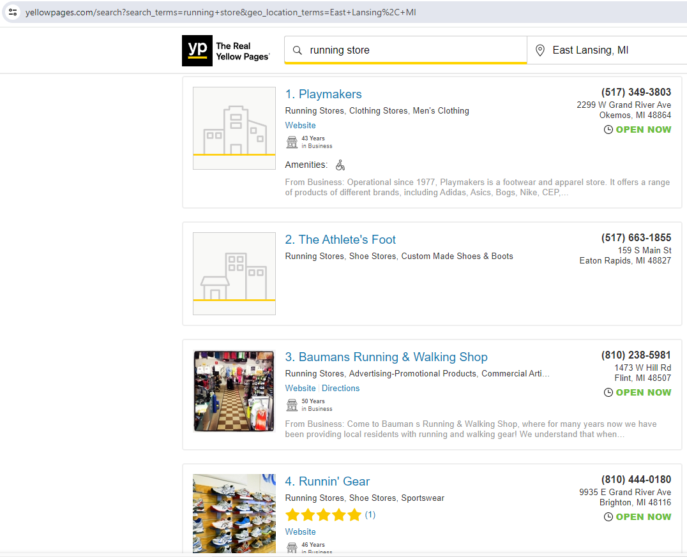
```
]

---

# Structure of Webpages

Webpages are largely made out of .hi-slate[two types of files] that we have to parse:

--
.pull-left[
.hi-medgrn[HTML]

* .hi-medgrn[H]yper.hi-medgrn[T]ext .hi-medgrn[M]arkup .hi-medgrn[L]anguage is a .hi-medgrn[markup language], Like Markdown
* It specifies the .hi-medgrn[structure] of a webpage.
]
--
.pull-right[
.hi-blue[CSS]

* .hi-blue[C]ascading .hi-blue[S]tyle .hi-blue[S]heets is a language for .hi-blue[formatting the appearance of a webpage]
  * CSS .hi-purple[properties] specify .hi-purple[how]to format: what font, what color, how wide
  * CSS .hi-pink[selectors] specify .hi-pink[what] to format: which structural elements get what rule
]

---

# How Websites Render Content

It's also worth realising that there are .hi-slate[two ways] that web content gets rendered in a browser:
  1. .hi-blue[Server-side (back-end)]
  1. .hi-medgrn[Client-side (front-end)]

<br>

You can read [here](https://www.codeconquest.com/website/client-side-vs-server-side/) for more details (including example scripts), but for our purposes the essential features are as follows...


---

# Server-Side Content Rendering

.pull-left[
The scripts that build a .hi-blue[server-side] website aren't run on our computer
  * Rather, the script that "builds" the site is .hi-blue[run on a host server]
    - All information is directly embedded in the webpage's HTML
  * For example,.hi-blue[Wikipedia] tables are already populated with all the info we see in our browser
]
.pull-right[
```{r, echo=F, out.width = "550"}
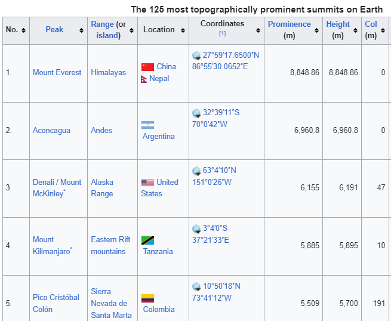
```
]


---

# Server-Side Content Rendering

.pull-left[
The scripts that build a .hi-blue[server-side] website aren't run on our computer
  * Rather, the script that "builds" the site is .hi-blue[run on a host server]
    - All information is directly embedded in the webpage's HTML
  * For example,.hi-blue[Wikipedia] tables are already populated with all the info we see in our browser
]
.pull-right[
* .hi-blue[Webscraping process:] finding the correct selectors (CSS or Xpath), iterating through (dynamic) webpages (e.g. "Next page" and "Show more" tabs)
* .hi-blue[Key concepts:] CSS, Xpath, HTML
]


---

# Client-Side Content Rendering

The scripts that build a .hi-medgrn[client-side] website aren't run on our computer

  * Website contains an empty template of HTML and CSS
    * May contain a "skeleton" table without any values
  * When we visit the page URL, our browser sends a .hi-medgrn[request] to the host server
  * If everything is okay (e.g. our request is valid), then the server sends a .hi-medgrn[response] script, which our browser executes and uses to populate the HTML template with the specific information that we want.


---

# Client-Side Content Rendering

  * If everything is okay (e.g. our request is valid), then the server sends a .hi-medgrn[response] script, which our browser executes and uses to populate the HTML template with the specific information that we want.

```{r, echo=F, out.width = "850"}
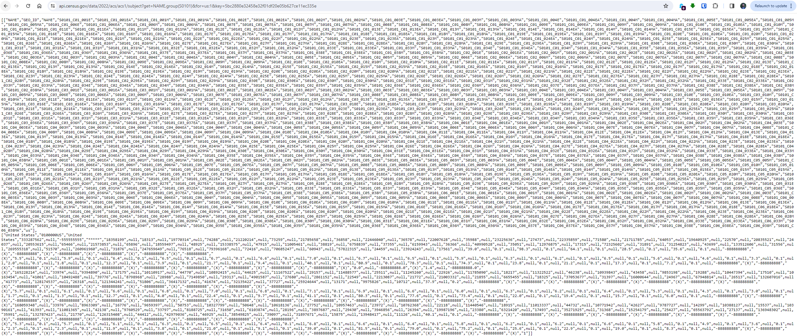
```
---

# Web Scraping

Over the next two lectures we'll cover the main differences between the two approaches and general workflows.

However, I want to forewarn that web scraping typically involves a fair bit of .hi-medgrn[detective work], iterating and adjusting steps
  * According to the type of data you want
  * To match the specifics of a given website

--

In short, web scraping involves .hi-blue[as much art as it does science.]

--

The good news, though: .hi-pink[if you can see it, you can scrape it.]

---
# Ethical + Legal Considerations

The last line brings up an important consideration: just because you .hi-medgrn[can] scrape it, doesn't mean you .hi-purple[should].

--

.pull-left[
.center[.underline[.hi-pink[Legality]]]

* In short, it is .hi-pink[currently legal] to scrape data from the web using automated tools as long as the data are .hi-pink[publicly available] (hiQ Labs vs. Linkedin)
  * We'll chat more later on about what this means for "hidden" APIs
* May get blocked due to violating a site's Terms of Service preventing scraping
]
.pull-right[
.center[.underline[.hi-purple[Ethicality]]]

* Need to consider the impact your scraper will have on the host server
  * Easy to write a function that can overwhelm a website's host with rapid requests
  * We'll return to the "be nice" mantra later on
]

---
class: inverse, middle
name: static

# Scraping Static Websites


---

# Static Scraping: Preliminaries


Today we'll be using [SelectorGadget](https://selectorgadget.com/), which is a Chrome extension that makes it easy to discover CSS selectors.
  * Install the extension directly [here](https://chrome.google.com/webstore/detail/selectorgadget/mhjhnkcfbdhnjickkkdbjoemdmbfginb).

--

Please note that SelectorGadget is only available for .hi-blue[Chrome]. If you prefer using .hi-medgrn[Firefox], then you can try [ScrapeMate](https://addons.mozilla.org/en-US/firefox/addon/scrapemate/).

---

# Static Scraping: Preliminaries

The primary R package that we'll be using today is [rvest](https://rvest.tidyverse.org/), a simple webscraping library inspired by Python's [Beautiful Soup](https://www.crummy.com/software/BeautifulSoup/), but with extra tidyverse functionality.

.hi-slate[rvest] is designed to work with webpages that are built server-side and thus requires knowledge of the relevant CSS selectors...

--

Which means that now is probably a good time for us to cover what these are in more detail.

---

# CSS Selectors

CSS .hi-pink[selectors] are the .hi-pink["what"] of the display rules. They identify which rules should be applied to which elements.
  * E.g. Text elements that are selected as .hi-medgrn[".h1"] (i.e. top line headers) are usually larger and displayed more prominently than text elements selected as .hi-medgrn[".h2"] (i.e. sub-headers).


The key point is that if you can .hi-pink[identify the CSS selector(s)] of the content you want, then you can .hi-pink[isolate it from the rest] of the webpage content that you don't want.

---

# Identifying CSS Selectors

There are two main ways to identify the relevant CSS selector:

--


.pull-left[
.center[.hi-purple[1\. Inspect the Page Source]]

* Retrieve from the underlying code
* Right-click and "Inspect" or "View Page Source"
* Identify the website's hierarchy + elements directly
* Requires (some) knowledge of HTML
]

--

.pull-right[
.center[.hi-medgrn[2\. SelectorGadget]]

* Retrieve visually from the rendered webpage
* Activate SelectorGadget
* Iteratively select/deselect items
* Can be sensitive to the selection process
]
---

# CSS Selectors and SelectorGadget


This where SelectorGadget comes in. We'll work through an extended example (with a twist!) below, but I highly recommend looking over this [quick vignette](https://rvest.tidyverse.org/articles/selectorgadget.html) soon.


.footnote[Here are two helpful links if you're interested in reading more about [CSS](https://developer.mozilla.org/en-US/docs/Learn/CSS/Introduction_to_CSS/How_CSS_works) (i.e Cascading Style Sheets) and [SelectorGadget](http://selectorgadget.com/)]


---

# Application 1: Wikipedia

Let's say you watched [Josh Kerr break the mile world record](https://worldathletics.org/news/feature/mile-world-record-josh-kerr-history-book) this July and got wondering about records in a *longer* running distance:  [The Marathon](https://en.wikipedia.org/wiki/Marathon_world_record_progression)
  * Women's record: 3:40:22 in 1926 to 2:11:53 in 2023!
  * Men's record: 2:55 in 1908 to 1:59:30 this April!
  * Might both be out of date after Chicago Marathon this year!

--

First, open up this page in your browser. Take a look at its structure: What type of objects does it contain? How many tables does it have? Do these tables all share the same columns? What row- and columns-spans? Etc.

---

# Application 1: Wikipedia

.pull-left[
```{r, echo=F, out.width = "550"}
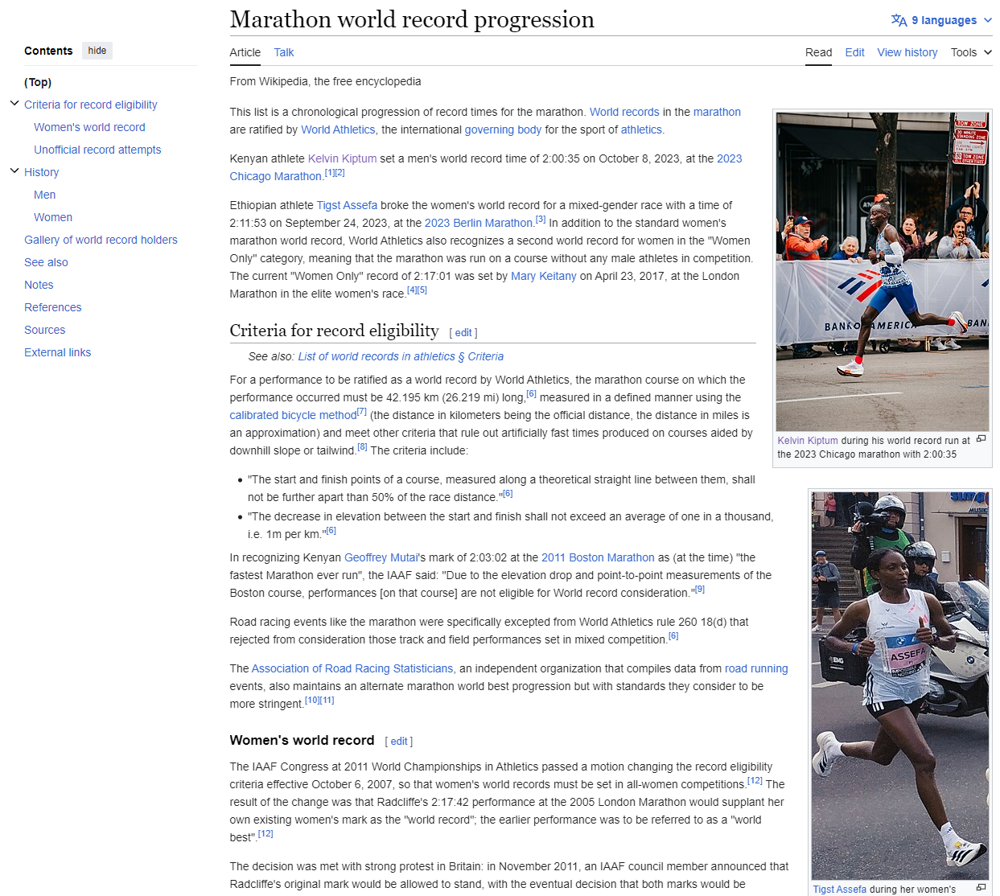
```
]
.pull-right[
```{r, echo= F, out.width = "550"}
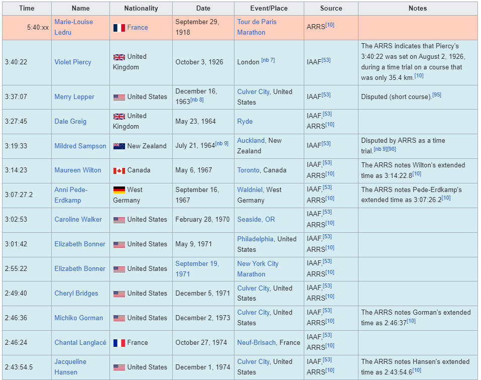
```
]

---
# Application 1: Wikipedia


Once you've familiarised yourself with the structure, read the whole page into R using the `rvest::read_html()` function.

```{r m100_read_html}
mthn = read_html("https://en.wikipedia.org/wiki/Marathon_world_record_progression")
mthn
```

---
# Application 1: Wikipedia

As you can see, this is an [XML](https://en.wikipedia.org/wiki/XML) document that contains .hi-slate[everything] needed to render the Wikipedia page.<sup>1</sup>

--

It's kind of like viewing someone's entire LaTeX document (preamble, syntax, etc.) when all we want are the data from some tables in their paper.


.footnote[<sup>1</sup> XML stands for Extensible Markup Language and is one of the primary languages used for encoding and formatting web pages.]

---
# First Table: Women's Records


Let's start by scraping our first table from the page, which documents the [women's record progression](https://en.wikipedia.org/wiki/Marathon_world_record_progression#Women).

The first thing we need to do is identify the table's unique CSS selector using SelectorGadget.

--

.hi-slate[Note:] this *will* require trial and error - and a lot of clicking.


---
# First Table: Women's Records

.less-left[Start by activating SelectorGadget and clicking on a chart element.]
.more-right[
.center[
```{r, echo=F, out.width = "800"}
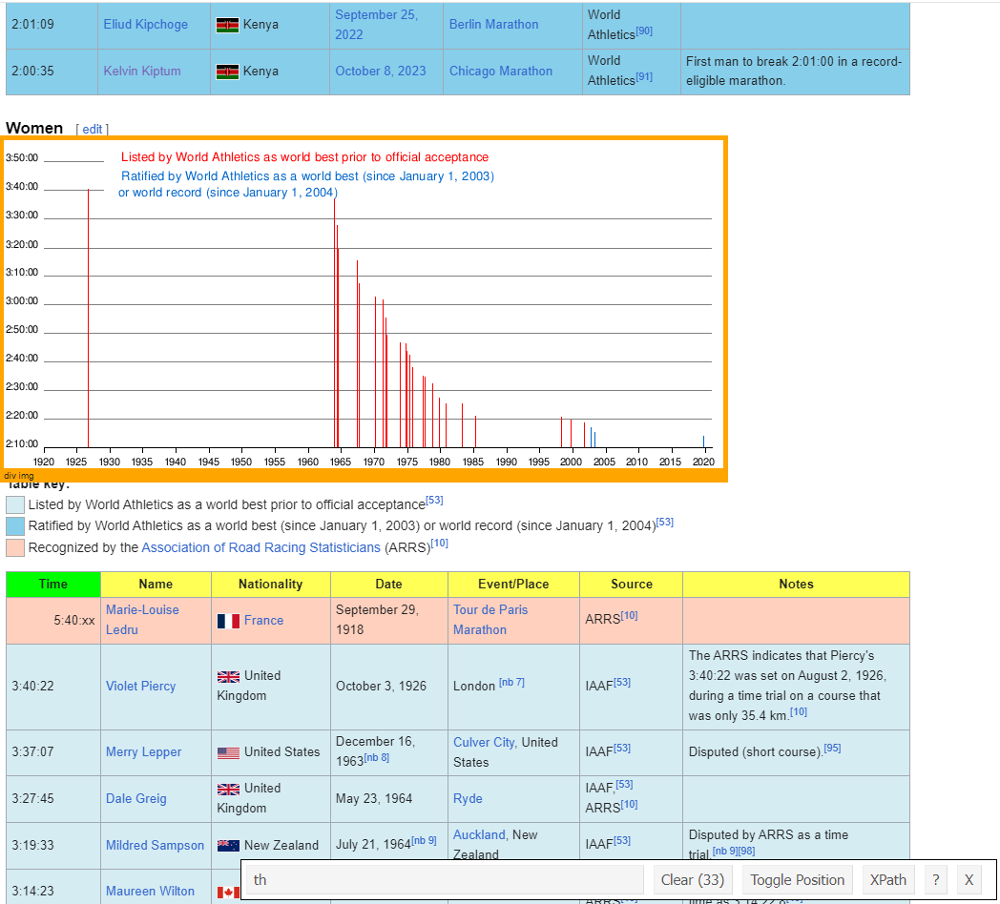
```
]
]

---
# First Table: Women's Records


.less-left[Clicking on another chart element expands the selection (but too much!)
]
.more-right[
.center[
```{r, echo=F, out.width = "800"}
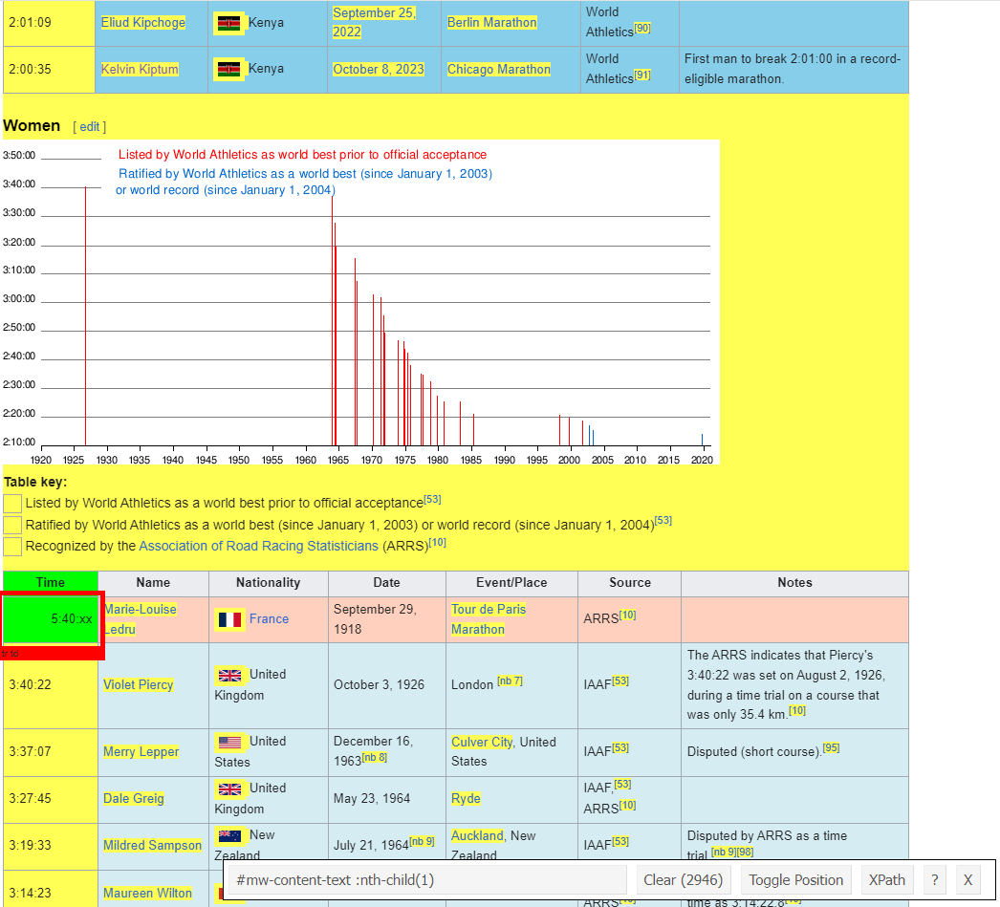
```
]
]

---
# First Table: Women's Records

.less-left[Click the elements you *don't* want until they turn red:

]
.more-right[
.center[
```{r, echo=F, out.width = "800"}
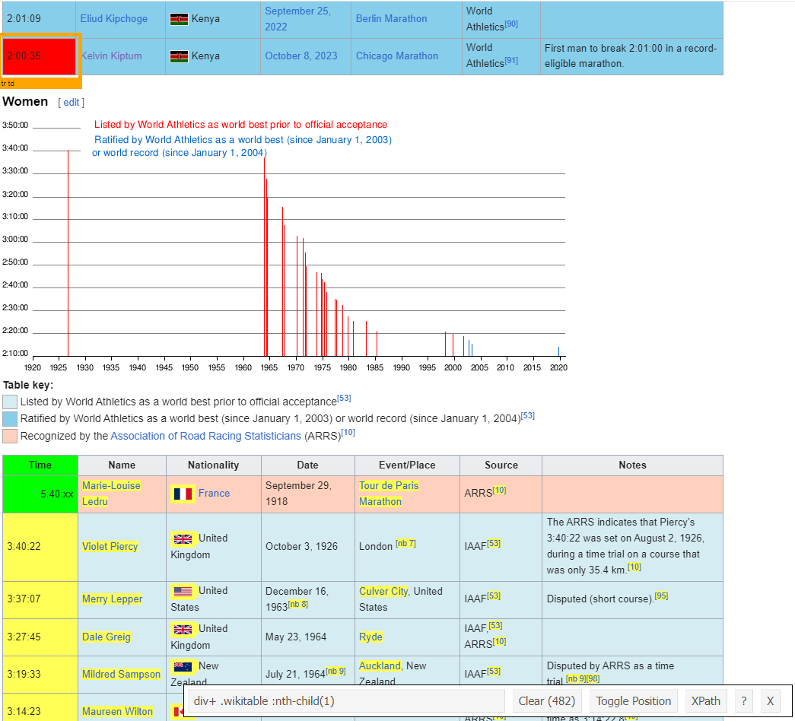
```
]
]


---
# First Table: Women's Records
Working through this iterative process yields

`"div+ .wikitable :nth-child(1)"`.

We can use this unique CSS selector to isolate the women's record table content from the rest of the HTML document.
  * .hi-medgrn[Extract the table content] with `html_element()`
  * Parse the .hi-pink[HTML table into an R data frame] with `html_table()`


---
# First Table: Women's Records

  * .hi-medgrn[Extract the table content] with `html_element()`
  * Parse the .hi-pink[HTML table into an R data frame] with `html_table()`

```{r women}
women <- mthn %>%
  html_element("div+ .wikitable :nth-child(1)") %>% ## select table element
  html_table()                                      ## convert to data frame

women
```


---
# First Table: Women's Records

Great, it worked! Now convert the date string to a format that R actually understands.<sup>2</sup>


```{r women_2}
women %>%
  mutate(Date = mdy(Date)) %>% ## convert string to date format
  head(2)
```
.footnote[<sup>2</sup> *Note:* If column name had spaces or capital letters, we could use the `janitor::clean_names()` convenience function to clean them. (Q: How else could we have done this?)
]

---
# First Table: Women's Records

Alright that mostly worked, but there are a few hyperlink references in the dates leading to `NA`s.
  * This is a case where using a regular expression is convenient: match the pattern `"[nb X]"` at the .hi-medgrn[end of the strings]

```{r women_3}
women <- women %>%
  mutate(across(where(is.character), # mutate across all character strings
                ~str_replace(.x, "\\[nb [0-9]+\\]$", "")), # remove [nb 0-9]
         Date = mdy(Date))  # convert string to date format

women
```
---
# Table 2: Men's Records

We could stop here and plot the women's records, but while we're here let's grab the men's records as well.


.hi-slate[Challenge:] take a couple minutes to use SelectorGadget and find the CSS selector for the men's record table.
  * Don't peek at next slide until you give it a shot!
```{r, eval = F}


```


---
# Table 2: Men's Records

```{r}
men <- mthn %>%
  html_element("p+ .wikitable :nth-child(1)") %>% ## add the selector!
  html_table()    %>%
  mutate(across(where(is.character), # mutate across all character strings
                ~str_replace(.x, "\\[nb [0-9]+\\]$", "")), # remove [nb 0-9]
         Date = mdy(Date))
tail(men)
```

---
# Browser Inspection Tools

SelectorGadget is a great tool, but sometimes it .hi-medgrn[takes more work than necessary] and isn't available in all browsers.

--
.pull-left[
.hi-slate[Alternate approach:] use the [inspect web element](https://www.lifewire.com/get-inspect-element-tool-for-browser-756549)
  * Chrome: Right-click > "Inspect" (`Ctrl + Shift + I`)
  * Scroll over source elements until the table of interest is highlighted
  * Use the selector that pops up over the element
    * i.e. `"table.wikitable"`
]
.pull-right[
.center[
```{r, echo=F, out.width = "800"}
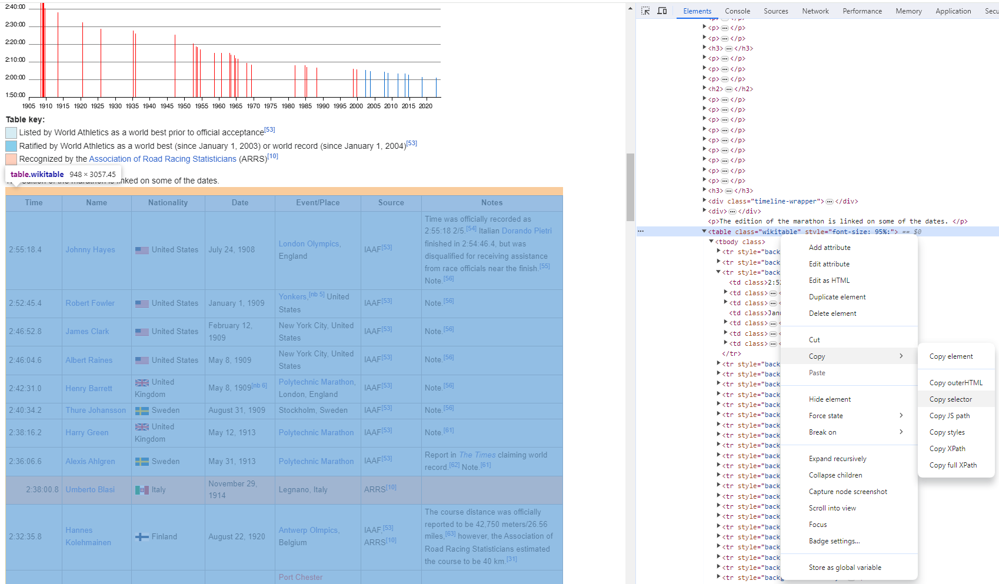
```
]
]

---
# Duplicate Selectors

If we look at the source code a bit more we can see that the selector `table.wikitable` .hi-medgrn[isn't unique]!

--

In cases like this, use `html_elements()` to retrieve all matching elements as a list
```{r}
mthn_tabs <- mthn %>%
  html_elements("table.wikitable") ## select all elements matching the selector

# first match is men's results
men2 <- mthn_tabs[[1]] %>% html_table()

# second match is women's results
women2 <- mthn_tabs[[2]] %>% html_table()
```

---
# Marathon Progression


.hi-slate[Challenge:] combine both tables into a single dataframe and plot the record progression
  * Clean the `Time` variable (get rid of alphanumeric characters at the end)
  * Separate the time variable into hours/minutes/seconds using `separate()`
  * Use `hours(), minutes(), seconds()` from `lubridate` to create a time variable for the marathon time
  * Create a plot with
    * Marathon time on the y-axis
      * Make sure to include a `scale_y_time()` layer!
    * Date on the x-axis
    * Linetype aesthetic mapping based on the group (men vs. women)
    * Use a nice theme

Answer in a few slides (no peeking until you've tried first)

---


---
# Marathon Progression

```{r, eval = F}
men <- mutate(men, Group = "Men")
women <- mutate(women, Group = "Women")

mthn_prog <- rbind(men, women) %>%
  mutate(Time = str_replace_all(Time, "[:alpha:]", "")) %>%
   separate(col = "Time", into = c("Hours", "Minutes", "Seconds"), sep = ":") %>%
  # add time variable using lubridate functions
  mutate(mthn_time = hours(Hours) + minutes(Minutes) + seconds(Seconds))


ggplot(mthn_prog, aes(x = Date, y = mthn_time)) +
  geom_line(aes(linetype = Group)) +
  scale_y_time() +
  labs(y = "Marathon World Record",
       x = "Year") +
  theme_minimal()
```


---
# Marathon Progression

```{r, echo = F}
men <- mutate(men, Group = "Men")
women <- mutate(women, Group = "Women")

mthn_prog <- rbind(men, women) %>%
  mutate(Time = str_replace_all(Time, "[:alpha:]", "")) %>%
   separate(col = "Time", into = c("Hours", "Minutes", "Seconds"), sep = ":") %>%
  # add time variable using lubridate functions
  mutate(mthn_time = hours(Hours) + minutes(Minutes) + seconds(Seconds))


ggplot(mthn_prog, aes(x = Date, y = mthn_time)) +
  geom_line(aes(linetype = Group)) +
  scale_y_time() +
  labs(y = "Marathon World Record",
       x = "Year") +
  theme_minimal()
```
---
class: inverse, middle
name: anoth_ex

# Another Static Example

---
# Scraping Static Sites

In the last example we saw how to use .hi-slate[rvest] functions to scrape information from .hi-medgrn[HTML Tables].
  * .hi-blue[Biggest Challenge:] finding the right CSS selectors<sup>1.</sup>
  
  
.footnote[<sup>1.</sup>
For more on all the ways to construct CSS selectors, check out [this handy W3 Guide](https://www.w3.org/TR/2011/REC-css3-selectors-20110929/)
]
--

<br>

Let's work through an example navigating another site's structure to get familiar with more helpful functions.


---
# Example 2: Des Linden


Let's say you got excited by all this marathon talk and wanted to gather more data about one of the most storied American marathoners:\ .hi-medgrn[Des Linden]

  * A native Michigander (originally from Charlevoix, MI)!

```{r, echo=F}
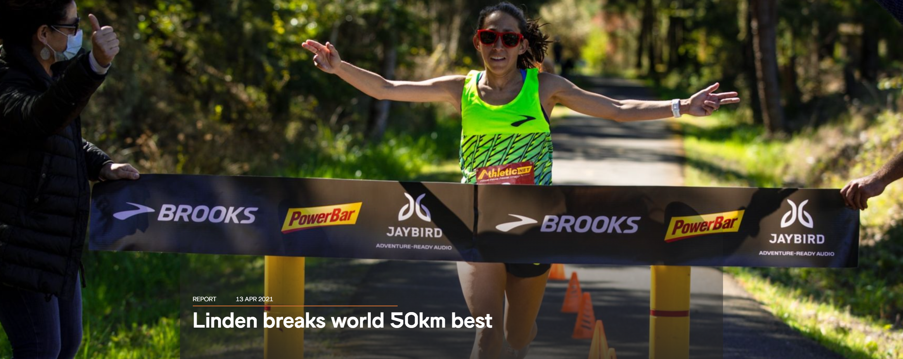
```
---
# Example 2: Des Linden

You know she ran the 2026 Boston Marathon this April, so you decide to scrape Des' [2026 Boston Marathon results page](https://www.baa.org/races/boston-marathon/results/?runner=173):
.center[
```{r, echo=F, out.width = "500"}
include_graphics("images/des_boston_26.png")
```
]

---
# Example 2: Boston 2026 Results


To start, read in the page's HTML with `read_html()`.

```{r, error = TRUE}
des_26 <- read_html("https://boston.r.mikatiming.com/2026/?content=detail&fpid=search&pid=search&idp=9TGHS6FF1C6C18&lang=EN_CAP&event=R&event_main_group=runner&search%5Bname%5D=Linden&search_event=R")
```
--

... or not.

---
# Example 2: Boston 2026 Results

Here's an early example of a common challenge: .hi-medgrn[web protections].

 * Increasingly, websites are adding protection protocols (e.g. Cloudflare) to block undesired automated traffic (i.e. genAI) 
 * If we look at the site's source code in our browser, we can verify that it's static and everything that we want to retrieve is there...
 * But when we try and retrieve that source code in R, the website's protections identify it as automated and reject our request
 
---
# Web Protections

The reason this happens is that, by default, R tells the website that it's the one making the request - and not a web browser like a human being would use.

```{r, echo=F, out.width = "800"}
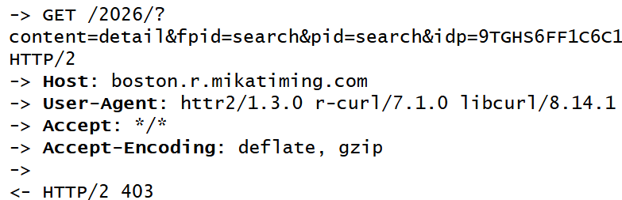
```


  * R is increasingly flagged as a (potentially) malicious bot and the page request is automatically denied 
  

---
# Web Protections and httr2

To get more information on this issue and to get around it, let's bring in the .hi-slate[httr2] package ("hitter 2").

  * .hi-slate[httr2] is the main tidyverse package for making HTTP requests
    * Updates/replaces httr
    
We'll use .hi-slate[httr2] methods for interacting with APIs in part 3 of this lecture, but we can use it now to switch up how R identifies its requests.

---
# httr2 Request Worfklow

In .hi-slate[httr2], we build + execute a request object over multiple function steps:
  
  1. Create a new request object with `request()`
  2. Define the request behavior with `req_` functions
  3. Perform the request with `req_perform()`
  4. Fetch the response with `resp_` functions

Let's see this in action while confirming our scraping issue!

---
# Web Protections and httr2

.font80[
```{r, error = TRUE}
request("https://boston.r.mikatiming.com/2026/?content=detail&fpid=search&pid=search&idp=9TGHS6FF1C6C18&lang=EN_CAP&event=R&event_main_group=runner&search%5Bname%5D=Linden&search_event=R") %>%
  req_verbose() %>%
  req_perform()
```
]

---
# Web Protections and httr2

This confirms that our request was denied (403 error).

To overcome this, we can modify the `User-Agent` part of our request to look like a regular web browser with `req_user_agent()`
  * Second argument: string value of the user agent we want to use
    * Check your browser's user agent on [useragentstring.com](https://useragentstring.com/)

.font90[    
```{r}
des_bos_req <- request("https://boston.r.mikatiming.com/2026/?content=detail&fpid=search&pid=search&idp=9TGHS6FF1C6C18&lang=EN_CAP&event=R&event_main_group=runner&search%5Bname%5D=Linden&search_event=R") %>%
  req_user_agent("Mozilla/5.0 (Windows NT 10.0; Win64; x64) AppleWebKit/537.36 (KHTML, like Gecko) Chrome/93.0.4577.82 Safari/537.36")
des_bos_req
```
]

---
# Web Protections and httr2

Now that the new user agent is set, let's try performing the request and reading in the HTML:

.font80[
```{r}
des_bos_26 <-  req_verbose(des_bos_req) %>%
  req_perform()
des_bos_26
```
]

---
# Extracting Response HTML

That worked! We can tell from the `Status: 200 OK`.

We can now extract the response HTML for the page's body with `resp_body_html()`:

```{r}
des_26 <- resp_body_html(des_bos_26)
```

---
# Example 2: Boston 2026 Results

What do we see when we look at the page?

.font90[
```{r}
des_26
```
]

--

<br>


1. The page's head information (`<head>`)
  * Contains metadata about the page (not actually displayed)
--

1. The page's body contents (`<body>`)
  * This is where all the stuff is


---
# Example 2: Boston 2026 Results

Look at the body's .hi-medgrn[child elements] with `html_children()`
  * all 10 elements nested under `body`
  * 2 popups and a consent "overlay"

.font80[
```{r, eval = T}
html_element(des_26, "body") %>% html_children()
```
]

---
# Example 2: Boston 2026 Results

  * all 10 elements nested under `body`
  * 2 popups and a consent "overlay"
  
This matches the .hi-medgrn[page source] (access with "Inspect")
```{r, echo=F, out.width = "600"}
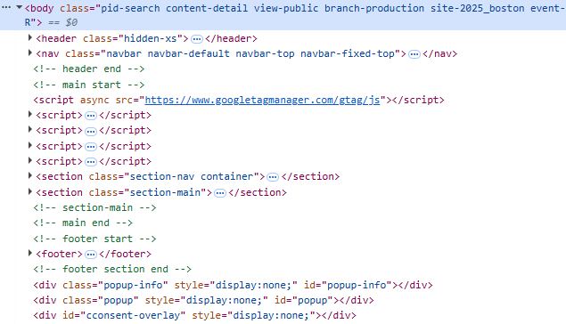
```

---
# Example 2: Boston 2026 Results

Let's start by grabbing all the information from the left half of the page.

Two main ways:

  1. Use SelectorGadget to find the selector visually
  2. "Inspect Element" and retrieve selector by navigating the HTML source code

---
# SelectorGadget Approach


Using SelectorGadget, identify the selector for the left-side contents.

.center[
```{r, echo=F, out.width = "600"}
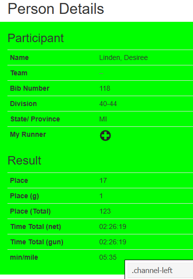
```
]


---
# Example 2: Boston 2026 Results

```{r}
des_26_l <- html_elements(des_26, ".channel-left")
des_26_l
```

What's here?


  * A `div` element with the class `col col-xs-12 col-md-6 detail-channel channel-left`
    * A Nested `div` element with the class `untabbed-boxes`

--

---
# Navigating HTML Structure

Let's jump straight to the `untabbed-boxes` element(s) using the CSS selector syntax `element.class`:

  * Here, that's `div.untabbed-boxed`
  
```{r}
des_26_l <- html_element(des_26, "div.untabbed-boxes") 
```

---
# Navigating HTML Structure

What do we have now?

```{r echo=FALSE}
des_26_l
```


Two elements:
  1. `detail-box box-general`: class of top half `div`
  2. `detail-box box-totals`: class of bottom half `div`


---
# Example 2: Boston 2026 Results

Inspecting the HTML shows this nested structure:


.center[
```{r, echo=F, out.width = "750"}
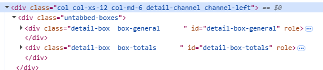
```
]

---
# Example 2: Boston 2026 Results

Start by grabbing the top half info with the full class:

  * Start a class selector with `.`
  * Replace spaces in a class selector with `.` too
  * Ignore the trailing white space

```{r}
des_26_lu <- html_element(des_26_l, ".detail-box.box-general")
```

---
# Example 2: Boston 2026 Results

**Q:** did we need the first half (`detail-box`)?

```{r}
identical(des_26_lu,
          html_element(des_26_l, ".box-general")
          )
```

**A:** No! since there's only one `box-general` here we can refer to it directly.


---
# Elements vs. Element

We can see the difference with `html_element()` and `html_elements()`
--

.pull-left[
  * `html_element()`retrieves the .hi-medgrn[HTML nodes] directly
    * same length as the input
      * If a single node, just one thing gets returned
      * if a nodeset, returns a same-length vector

```{r}
html_element(des_26, ".detail-box")
```
]
--

.pull-right[
  * `html_elements()`retrieves the .hi-blue[nodeset itself]
    * Contains all nodes that match

```{r}
html_elements(des_26, ".detail-box")
```
]

---
# Example 2: Boston 2026 Results

What does the left upper box contain?

```{r}
des_26_lu
```

The node we grabbed *itself* contains two elements:
1. An `h3` title, and
1. A table (`table`)

---
# Example 2: Boston 2026 Results

Alternatively, to view .hi-purple[all elements AND all child elements], use the wildcard selector `*` in `html_elements()`
  * Ignores structure/nesting

.font90[
```{r}
html_elements(des_26_lu, "*")
```
]

---
# Grabbing Text

If we want to grab the text from the third-level heading `h3`, we can use
--

.pull-left[
1\. `html_text()`: retrieves the .hi-medgrn[raw, underlying text]

```{r}
html_elements(des_26_lu, "h3") %>%
  html_text()
```
]
--

.pull-left[
2\. `html_text2()`: retrieves the text .hi-purple[as displayed in a browser]

```{r}
html_elements(des_26_lu, "h3") %>%
  html_text2()
```
]

<br>

Here the difference is whether we keep the line break special character `\n` or not.

---
# Example 2: Boston 2026 Results

More conveniently, we can grab the (full) table with `html_table()`
  *  `html_table()` recognizes the tabular format of an HTML table, automatically converts to a tibble data frame (easiest option)

```{r}
part_tab <- des_26_lu %>%
  html_element("table.table-condensed") %>%
  html_table()

part_tab
```

---
# Example 2: Boston 2025 Results

.hi-slate[Challenge:] get the contents of the "Result" table (bottom-left)
.pull-left[
.hi-medgrn[Workflow:]
  * Start with `des_26_l`
  * Use `html_element()` (likely twice) to get the bottom table
  * Format as a data frame with `html_table()`
]
.pull-right.center[
```{r, echo=F, out.width = "500"}
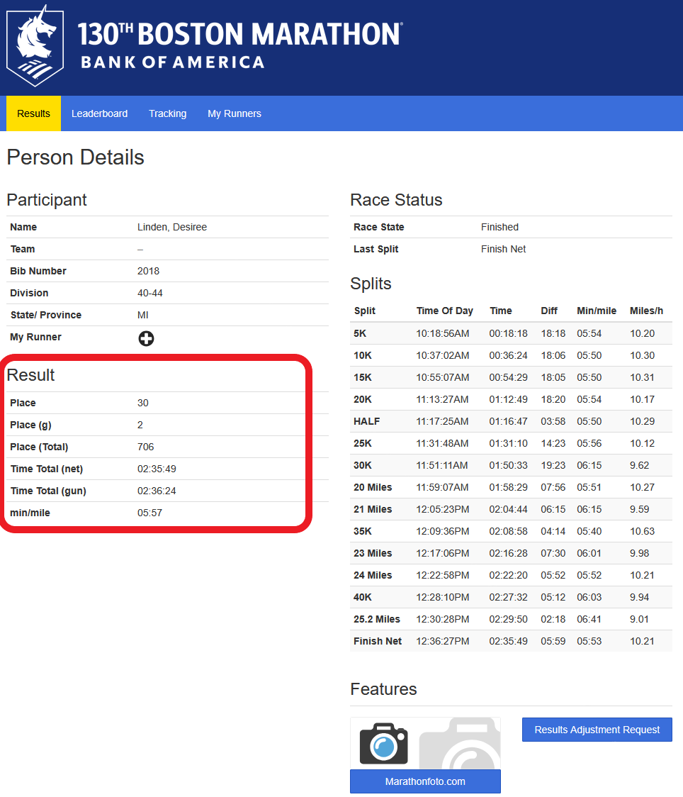
```
]

---
# Example 2: Boston 2025 Results

```{r}
res_tab <- des_26_l %>%
  html_element(".box-totals") %>%
  html_element(".table-condensed") %>%
  html_table()
head(res_tab)
```
---
# Example 2: Boston 2026 Results

Now that we have the left side stuff, let's grab the right side!

Conveniently, the selector follows the same naming convention

```{r}
des_26_r <- des_26 %>% html_element(".channel-right") %>%
  html_element("div.untabbed-boxes")
des_26_r
```

---
# Example 2: Boston 2026 Results

Here we can see that all the right-side info is *also* being stored in HTML tables.

We *could* manually grab both the tables again... *or* we can take advantage of `html_elements()` retrieving all matches at once
  * Pull *all* `table` elements from `des_26`

--

```{r}
html_elements(des_26, ".table")
splits <- html_elements(des_26, ".table")[4] %>% html_table()
```
---
# Example 2: Boston 2026 Results

Finally, let's get the url links from the "Features" box buttons

.center[
```{r, echo=F, out.width = "400"}
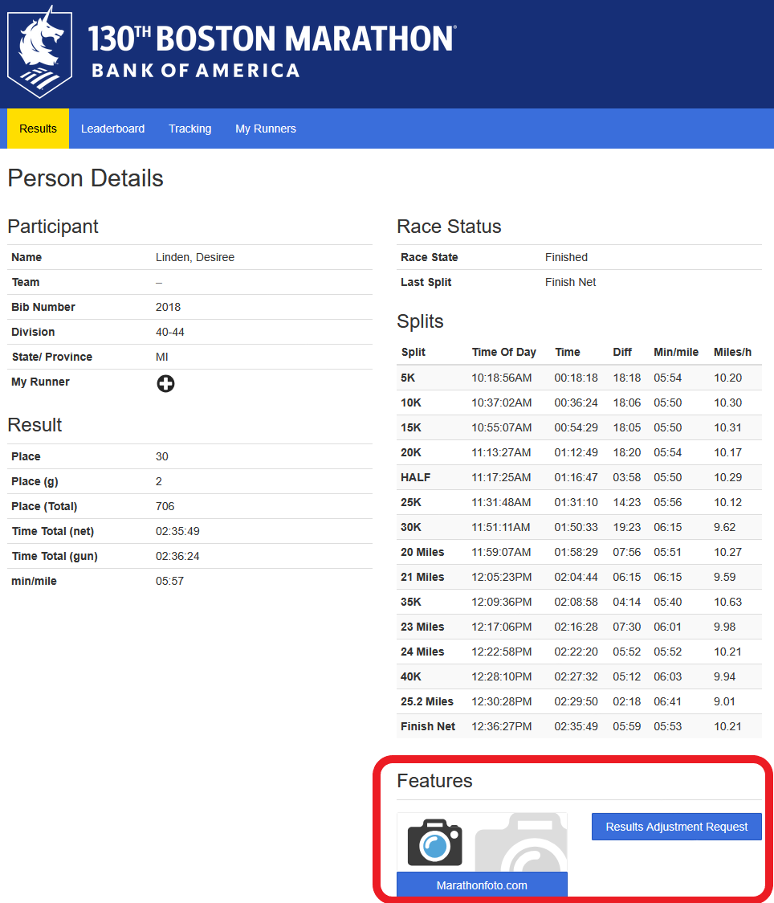
```
]

---
# Retrieving Links

.pull-left[
.hi-medgrn[Workflow:]
* Start with `des_26`
]
.pull-right[

<br>

```{r}
des_26 #<<
```
]

---
# Retrieving Links

.pull-left[
.hi-medgrn[Workflow:]
* Start with `des_26`
* Navigate to the right side (`.channel-right`)
]
.pull-right[

<br>
```{r}
des_26 %>%
  html_element(".channel-right") #<<
```
]

---
# Retrieving Links

.pull-left[
.hi-medgrn[Workflow:]
* Start with `des_26`
* Navigate to the right side (`.channel-right`)
* Navigate into the feature box (`.box-features`)
]
.pull-right[

<br>

```{r}
des_26 %>%
  html_element(".channel-right") %>%
  html_element(".box-features") #<<
```
]

---
# Retrieving Links

.pull-left[
.hi-medgrn[Workflow:]
* Start with `des_26`
* Navigate to the right side (`.channel-right`)
* Navigate into the feature box (`.box-features`)
* Retrieve the elements matching the button class (`a.btn.btn-primary.btn-block`)
]
.pull-right[

<br>

```{r}
des_26 %>%
  html_element(".channel-right") %>%
  html_element(".box-features") %>%
  html_elements("a.btn.btn-primary.btn-block") #<<
```
]

---
# Retrieving Links

.pull-left[
.hi-medgrn[Workflow:]
* Start with `des_26`
* Navigate to the right side (`.channel-right`)
* Navigate into the feature box (`.box-features`)
* Retrieve the elements matching the button class (`a.btn.btn-primary.btn-block`)
* Use `html_attr("href")` to retrieve all values of the `href` attributes
]
.pull-right[

<br>

```{r}
des_26 %>%
  html_element(".channel-right") %>%
  html_element(".box-features") %>%
  html_elements("a.btn.btn-primary.btn-block") %>%
  html_attr("href") #<<
```
]


---
# Structured v Unstructured

Here nearly everything was nicely formatted in HTML tables, which `html_table()` automatically converts into a structured format.

If what you want is unstructured/not together, you'll need to figure out the .hi-medgrn[individual selectors] and put them together in a .hi-red[custom data object]
```{r}
data.frame(
  athlete = "Des Linden",
  title = html_element(des_26, "a.navbar-brand") %>% html_element(".hidden-xs") %>% html_text2(),
  back_link = html_element(des_26, ".tt-help")  %>% html_attr("href")

)

```

---
# Summary: Static Scraping

When scraping static web content rendered server-side:

  * Try reading in the webpage with the .hi-slate[rvest] package
    * If it doesn't work, use .hi-slate[httr2] methods to change the user agent
  * Find the relevant CSS selectors
  * Use the .hi-slate[rvest] package to parse the HTML document
    * Tabular workflow: `read_html(URL) %>% html_elements(CSS_Selectors) %>% html_table()`
    * Might need other functions depending on content type (e.g. `html_text/text2(), html_attr(), html_children()`)

---

# Table of Contents

1. [Prologue](#prologue)

2. [Intro to Web Scraping](#web)

3. [Scraping Static Websites](#static)

4. [Interacting with Static Websites](#interact)


```{r gen_pdf, include = FALSE, cache = FALSE, eval = FALSE}
infile = list.files(pattern = 'Acquisition-Static.html')
pagedown::chrome_print(input = infile, timeout = 200)
```